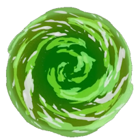
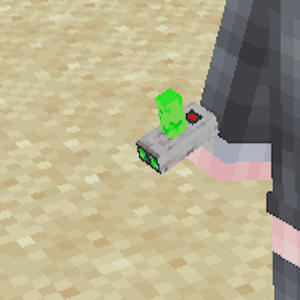
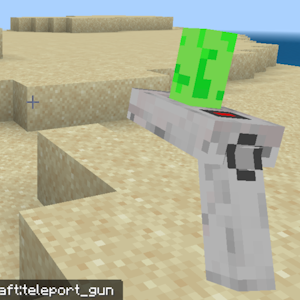
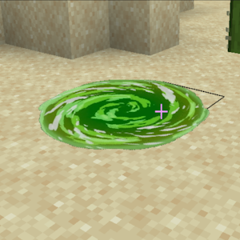

# TeleportGun - Nukkit传送枪插件

## 功能特性

✨ **真实模型与粒子效果**  
- 精美的3D传送枪模型
- 炫酷的传送门粒子特效

🌍 **跨维度传送**  
- 支持多个地图纬度的传送
- 可传送玩家、生物和掉落物

🚪 **双向传送门**  
- 创建永久或临时的双向传送门
- 可自定义传送门大小和颜色

📍 **传送点管理**  
- 设置个人传送点
- 管理员可创建公共传送点

## 快速开始

1. 将插件放入`plugins`文件夹
2. 重启服务器
3. 在创造背包中拿出：
4. 右键射击创建传送门入口，再次射击创建出口
5. 拖动传送液到传送枪即可补充

## 配置选项

编辑`config.yml`可调整：
- 传送冷却时间
- 传送门持续时间
- 粒子效果强度
- 模型颜色变体

## 效果展示

<table>
  <tr>
    <td></td>
    <td></td>
  </tr>
  <tr>
    <td></td>
    <td></td>
  </tr>
  <tr>
    <td></td>
    <td></td>
  </tr>
</table>

